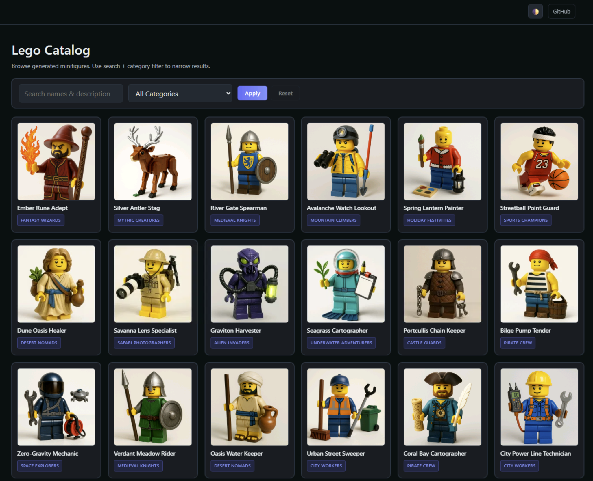

# MicroHack: Application Innovation
What is the next generation of modernization and why does it matter?

## MicroHack Context
We will work with simple Web applications built on .NET and SQL Server.



Application is deployed in a way that do not leverage power of the cloud well, cannot provide auto-scaling and serverless deployment, HA is problematic in its current form, deployment process is manual and error-prone.

Note: All data in our application has been AI-generated and is for testing purposes only. We have generated a batch for you, but if your interested in generating your own, see [dataGenerator](/dataGenerator/README.md).

## MicroHack Objectives
- Learn how to take application from VM and deploy it using modern platform services using containers in **Azure Container Apps** and **Azure SQL Database**
- Investigate **auto-scaling** capabilities for application and databases including **scale-to-zero**
- Learn how to use Azure for **testing performance and functionality** of applications
- Automatically deploy changes using **CI/CD pipelines** and introduce staging environment and approval workflow in **GitHub Actions**
- Learn how to enable modern application monitoring and tracing using standard **OpenTelemetry**
- Optionally implement strict **security controls** and compliance measures
- Optionally enhance application with **AI capabilities**
- Learn to effectively use **GitHub Copilot** for brainstorming, analysis, writing scripts and Infrastructure as Code templates

## MicroHack Challenges
Focus on implementing **at least first two challenges today** as minimum out of four major challenges. 

Challenge 5 is designed for participants that have time to spare or as follow-up tasks after MicroHack and come in two optional flavors. Enterprise flavor is to enhance enterprise-grade security of the solution while Innovation flavor is to implement AI assistant capabilities into our application.

## MicroHack tips
- Use **GitHub Copilot** to help you write code faster and with fewer errors. If you do not have GitHub Copilot Business/Enterprise/Pro license, ask facilitator to
- Take advantage of **Azure documentation** and **samples** to understand how to use different services.
- Don't hesitate to **ask for help** from your peers or mentors if you get stuck.
- There are more ways to achieve challenges, but in general we recommend going **step-by-step**, testing along the way and use **repeatable patterns** (Infrastructure as Code).
- Lab environment comes with Virtual Machine that can be used as **developer station** and has been tested for all challenges. You can use other options such as your own device or GitHub Codespaces, but in case of any issues you can always work from this VM.
- Some components come with their own README.md file in respective folder. This might be useful to understand how to run application or what environmental variables are supported.
- Challenges except for ch05-innovation are designed in a way that you do not have to change any code to succeed.

### Prerequisites and existing infrastructure
You must have GitHub account so you can ask for GitHub Copilot license for our session and to fork repository later in challenge 3.

There is Azure subscription and Resource Group deployed for you and facilitator will provide you with login. Note due to security rules in training tenant you might be required to enroll this account to MFA. Inside you will find Virtual Machine with credentials ```azureuser``` and password ```Azure12345678``` accessible via Bastion host from Azure Portal. This VM contains application that use local SQL Server Express, .NET app and image files stored in a folder.

After VM starts use PowerShell script ```C:\start-app.ps1``` to run your application and access it at ```http://localhost:5000```.

You can also use this VM as your developer station. To quickly install tools such as Docker environment, Azure CLI, SQL Server Management Studio, git and Visual Studio Code execute PowerShell script ```C:\dev-tools-install.ps1```. You may also use your local computer or GitHub Codespaces for this MicroHack if you prefer.

Source code and important documentation for this application is stored in ```dotnet``` folder of this repository. In order to automate CI/CD later in a lab we suggest to clone this repo into your development environment.

### ch01: Migrate database, containerize application, deploy to Azure
[Challenge](/challenges/ch01/README.md) | [Solution]( /solutions/ch01/README.md)

### ch02: Test autoscaling under load
[Challenge](/challenges/ch02/README.md) | [Solution]( /solutions/ch02/README.md)

### ch03: Implement CI/CD pipeline to automatically deploy changes
[Challenge](/challenges/ch03/README.md) | [Solution]( /solutions/ch03/README.md)

### ch04: Monitor application performance with tracing
[Challenge](/challenges/ch04/README.md) | [Solution]( /solutions/ch04/README.md)

### ch05-enterprise: Implement security best practices
TBD

### ch05-innovation: Implement AI assistant
TBD